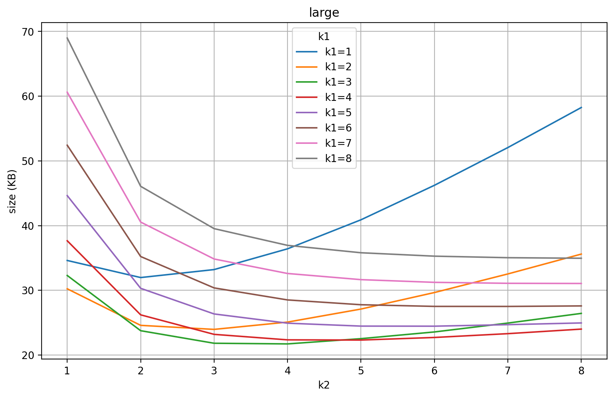
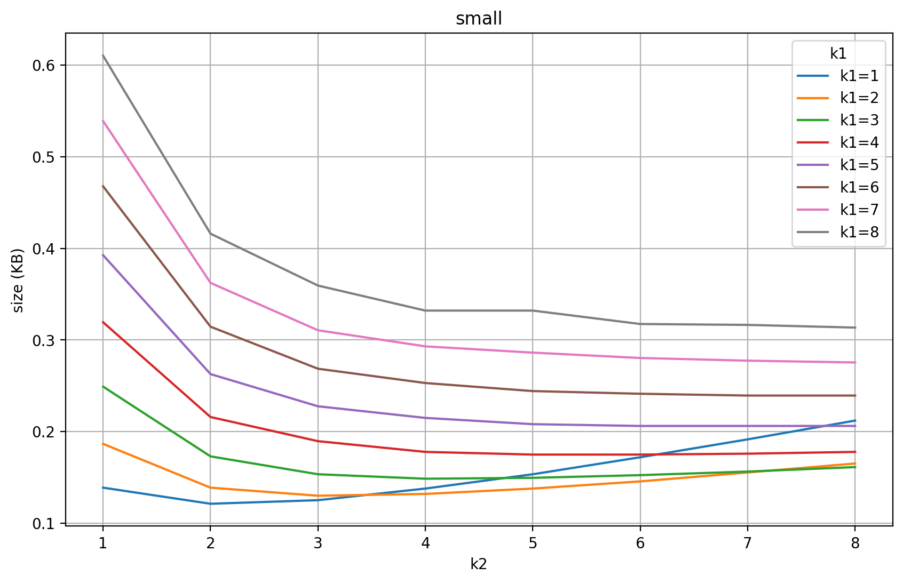

# algoritme

## snel

### opbouwen

$C_1 \Rightarrow BF_1(C_2, C_3, ..., C_n) \Rightarrow C_1'$

$C_2 \Rightarrow BF_2(C_1', C_3, C_3, ..., C_n) \Rightarrow C_2'$

$C_3 \Rightarrow BF_3(C_1', C_2', C_4, C_5, ..., C_n) \Rightarrow C_3'$

$...$

$C_n \Rightarrow BF_n(C_1', C_2', ..., C_{n-1}') \Rightarrow C_n'$

Bij $BF_i$ als het antwoord "neen" is, dan weten we dat het sowieso in de bijhorende $C_i$ zit.

Zo hebben we al veel elementen kunnen uitsluiten.

Dan kunnen we de volgende cascadetrap analoog doen met $C_1', C_2', ..., C_n'$

### classificiëren

Indien de categoriëen die we in een bloomfilter zullen steken allemaal leeg zijn, stopt ons algoritme.

Indien alle categoriëen behalve 1 leeg zijn na het afwerken van de volledige trap, stopt ons algoritme ook.

Na het stoppen zal er 1 niet-lege categorie overblijven, hiermee kunnen wij dus de gevallen classificeren die overal (false-)positives zijn.

## minder opslag

Het vorige algoritme is simpel en snel, maar we kunnen beter doen omtrent opslag (voor grote verzamelingen).

### opbouwen

Het is een uitbreiding van het snelle algoritme.

Noem $C_1', ..., C_{i - 1}', C_{i + 1}, ..., C_n = \bar{C_i}$

Om $BF_i(\bar{C_i})$ uit het snelle algoritme te verkleinen zullen we $\bar{C_i}$ eerst filteren met een kleinere bloomfilter van $C_i$:

$\bar{C_i} \Rightarrow BF_{i_1}(C_i) \Rightarrow \bar{C_i'}$

Nu kunnen we de volgende bloomfilter opstellen:

$C_i \Rightarrow BF_{i_2}(\bar{C_i'}) \Rightarrow C_i'$

Dus $BF_i$ wordt vervangen door 2 bloomfilters $BF_{i_1}$ en $BF_{i_2}$. Maar deze gebruiken samen minder bits bij een grote verzameling met ongeveer gelijk verdeelde categoriëen en de grootte van de nieuwe categorieën ($C_1', C_2', ..., C_n'$ na de eerste stap) zal gemiddeld hetzelfde zijn.

De rest van het opbouwen is analoog aan het vorige algoritme.

### classificiëren

Indien $BF_{i_1}$ als antwoord neen geeft, skippen we $BF_{i_2}$ en gaan we direct naar $BF_{(i + 1)_1}$

Indien het anwoord ja was checken we $BF_{i_2}$, indien neen zit het in $C_i$ en stoppen we, indien ja gaan we over naar $BF_{(i + 1)_1}$

Indien $\bar{C_i}'$ leeg is, dan maken we geen $BF_{i_2}$, in dit geval als het antwoord ja is bij $BF_{i_1}$ weten we dat het element in categorie $C_i$ zit

Note: De grootte van het cascade bestand is kleiner, maar dit algoritme gebruikt meer geheugen.

<TODO: Snel algoritme is amper sneller, mss hernoemen naar "eenvoudig algoritme" ofzo>

# # bits en hashfuncties

\# hashfuncties optimaal: $k = \frac{n}{m} * \ln{2}$ met $m = \text{\# elementen}$ en $n = \text{\# bits}$

kans op false positives: $(1 - e^{\frac{-km}{n}})^k$

kans bij optimale k: $(1 - e^{-\ln{2}})^{\frac{n}{m} * \ln{2}} = (1 - \frac{1}{2})^{\frac{n}{m} * \ln{2}} = (\frac{1}{2})^{\frac{n}{m} * \ln{2}}$

hoeveel moet n i.f.v. met m zijn om de $\text{kans} \leq x$ te maken?

$$
(\frac{1}{2})^{\frac{n}{m} * \ln{2}} \leq x 
\Leftrightarrow 
2^{\frac{n}{m} * \ln{2}} \geq \frac{1}{x}
\Leftrightarrow
\frac{n}{m} * (\ln{2})^2 \geq \ln{(\frac{1}{x})}
\Leftrightarrow
n \geq -m*\frac{\ln{x}}{(\ln{2})^2}
$$

neem voor x telkens een negatieve macht van 2: $x = 2^{-p}$ met $p = 1, 2, 3, ...$

dan wordt onze formule:

$n \geq \frac{m * p}{\ln 2}$

indien het een gelijkenis is heb je:

$k = \frac{\frac{m * p}{\ln 2}}{m} * \ln 2 = p$

Vanaf nu zal ik k gebruiken om naar p te refereren

Dus als we kans op false positives 1/32 willen en m = 1 MB (1 000 000 B) dan hebben we:

$n \geq \frac{5}{\ln 2} \text{ MB} = 7.213... \text{ MB}$

en $k = 5$

We zullen dus nu een k meegeven aan de bloomfilter om de n mee te berekenen zodanig dat de kans op false positives kleiner is dan $2^{-k}$

Waarom doe ik $2^{-k}$ als kans en geef ik de k mee om daaruit de n te halen i.p.v. de kans op false positives mee te geven en daaruit de k en n te halen?

Omdat de afrondingen dan veel minder doorwegen. Nu heb ik afrondingen op mijn aantal bits dat makkelijk een paar miljoen kan zijn, terwijl ik geen afrondingen heb op mijn k.

Bv. een afronding van 5.4 naar 5 bij de k zal meer verschil geven dan een afronding van 1234567.4 naar 1234567, niet alleen doordat het getal daardoor relatief minder verkleint, maar ook omdat ik die n toch moet afronden naar een getal deelbaar door 8 (aangezien ik een `uint8_t*` gebruik voor de bloomfilter bits). Dus 1234567.4 wordt 1234567, maar dan 1234568 om deelbaar door 8 te worden, dus de afronding maakt geen verschil.

## benchmarks

Ik zal geen rekening houden met tijd, aangezien de opslagruimte van de files het belangrijkst is.

Om te zien of k aan te passen per cascadetrap iets hielp heb ik op het eenvoudig algoritme met de large.txt de volgende benchmarks uitgevoerd:

k = 3 voor de eerste cascadetrap:

`k` 57 MB, `k++` 58 MB, `k--` 57 MB

Conclusie, gebruik dezelfde k bij elke cascadetrap.

Hypothese, de optimale k is quasi hetzelfde, onafhankelijk de grootte van de verzameling.

### snel algoritme

**large.txt**

`k=1` 53 MB, `k=2` 53 MB, `k=3` 57 MB, `k=4` 64 MB, `k=5` 73 MB

**medium.txt**

`k=1` 6.3 MB, `k=2` 7.0 MB, `k=3` 8.1 MB, `k=4` 9.5 MB, `k=5` 12 MB

**small.txt**

`k=1` 128 KB, `k=2` 7144 KB, `k=3` 168 KB, `k=4` 200 KB, `k=5` 236 KB

Conclusie, de optimale k voor het snel algoritme is 1 en mijn hypothese klopt.

### minder opslag algoritme

Aangezien ik heb geconcludeerd dat de hypothese klopt, is het enkel nodig om de large.txt te benchmarken, maar voor volledigheid zal ik ook de rest doen.

k1 wordt gebruikt voor $BF_{i_1}$ en k2 voor $BF_{i_2}$

Zie figure 1-3.

We zien dat (3, 4) het beste is voor large en medium en (1, 2) voor small.

Maar de hypothese klopt nog steeds, aangezien de size voor (3, 4) bij small amper scheelt met die voor (1, 2), dus neem ik overal (3, 4).

# bestandsformaat cascade

vooraf:
- 1 byte die het soort algoritme aangeven (0 = snel algoritme, 1 = algoritme met weinig opslag)
- aantal categoriëen (4 byte) = aantal bloomfilters per trap
- namen van categoriëen in juiste volgorde (1 byte lengte + 1 byte * lengte)

elke cascade trap:
- /

elke bloomfilter binnen de trap:
- aantal hashfuncties in bloomfilter (1 byte)
- seeds voor hashfuncties (1 byte seeds * aantal hashfuncties)
- aantal bits in bloomfilter / 8 (4 byte)
- bloomfilter bits (1 byte * aantal bits / 8)

indien een bloomfilter leeg is (doordat de bijhorende categorie leeg is), is er 1 byte aan 0-bits voor het aantal hashfuncties en dan ga je over naar de volgende bloomfilter

- einde van bloomfilters aankondigen met 1 byte aan 1-bits

- dan eindigen met de laatste niet lege categorie naam (1 byte lengte + 1 byte * lengte)

# limitaties

Voor de categorie namen is er een limitatie van 256 chars bij zowel `train` als `classify`

Indien een ingegeven element bij `classify` in geen enkele categorie zit, dan zal deze geclassificeerd worden als een random categorie.

Voor de nummers (aantal elementen, aantal bits ...) is er een limitatie van 32 bits (0 - 4,294,967,295)

Bv. het aantal elementen in `large.txt` is 25,000,000 en pas vanaf we een $k \geq 120$ hebben zal het aantal bits voor een bloomfilter voor alle categoriëen (wat we nooit creëeren) daar groter zijn dan de limitatie, maar ik gebruik $k \leq 4$ en dan kan je 744,261,117 elementen hebben, dus deze limiet is voldoende. 

Ik kan het verhogen naar 64 bit unsigned integers, maar dat zal het aantal geheugen onnodeloos vergroten, aangezien de laatste 32 bits quasi nooit gebruikt zullen worden en we veel zo'n nummers zullen gebruiken. 

Ook zal ik daardoor een andere hash functie moeten vinden, aangezien de implementatie van murmur has die ik op het internet vond 32 bit unsigned integers retourneert.

